# user_id 相关 

- 直接使用主键 id 作为用户 id，在分库分表时不友好
- 如果使用 uuid，没有规律，在排序的时候不友好

因此使用 **雪花算法** 生成分布式 ID

## 分布式 ID 特点

- 全局唯⼀性：不能出现有重复的ID标识，这是基本要求。
- 递增性：保证生成的 ID 是递增的
- 高可用性
- 高性能性

## 雪花算法

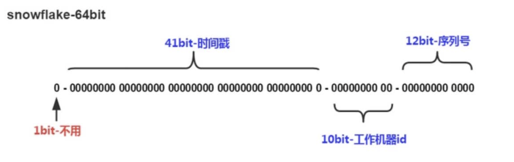

1. 第一位 占用1bit，其值始终是0，没有实际作用。
2. 时问戳 占用41bit， 单位为毫秒，总共可以容纳约69年的时间。当然，我们的时间毫秒计数不会真的从1970年开始记，那样我们的系统跑到 2039/9/7 23:47：35 就不能用了，所以这里的时间戳只是相对千某个时问的增量，比如我们的系统上线是2020-07-01，那么我们完全可以把这个timestamp当作是从 2020-07-01 00:00：00.000 的偏移量。
3. 工作机器id 占用10bit，其中高位5bit是数据中心1D，低位5bit是工作节点1D，最多可以容纳1024个节
点。
4. 序列号 占用12bit， 用来记录同毫秒内产生的不同id。每个节点每毫秒0开始不断累加，最多可以累加到4095，同一毫秒一共可以产生4096个1D。

## 前端 ID 失真问题

Javascript 能够表达的最大的数字为 $2^53 - 1$

但是随着时间的增长，我们生成的 user_id（int64） 最终将会超过该值，如果将该 id 传给前端，数据将会溢出

解决方法：

在序列化和反序列化 json 数据时，将 ID 字段按照字符串的方式序列化和反序列化

> 小技巧：可以在字段的 json Tag 加上 `string` 指定（反）序列化方式
> 
> ```go
> ID       int64  `json:"id,string"`
> ```

# Token 相关

<!-- 只使用 access_token 的问题 -->
<!-- 引入 refresh_token -->
<!-- 流程 -->

# 限流

## 漏桶算法

漏桶算法用于 **控制** 以固定速率进入的数据流以匹配事先规定的 **峰值流量** ，防止突发数据流量对网络设备和带宽的影响。

漏桶算法的核心思想类似于一个有限容量的水桶，数据包就像水滴一样进入水桶。如果水滴的到来速度超过了水桶的容量，多余的水滴就会被 **丢弃** 或 **排队等待** 。这样可以限制流量的峰值，使其匀速地输出，从而避免网络拥塞和突发数据包。

漏桶算法的主要特点和工作原理如下：

1. **固定速率输出：** 算法通过一个固定的速率来输出数据，无论输入数据的速率如何，输出速率都是恒定的。

2. **有限容量的缓冲区：** 算法使用一个有限容量的缓冲区（即水桶），当输入数据到达时，会放入缓冲区。如果缓冲区已满，多余的数据包将被丢弃。

3. **按顺序输出：** 缓冲区中的数据包按照它们的到达顺序输出，而不会因为某些数据包的突发到来而优先输出。

4. **速率控制：** 漏桶算法通过控制输入数据的速率，以确保输出数据的速率不会超过预定的速率。

漏桶算法在某些实时性要求高的应用中可能不适用，例如秒杀系统的限流，如果此时没有可用的水滴，将会 **阻塞**，而客户端并不希望服务端阻塞请求，而是较快（立即）返回秒杀结果

### ratelimit 库

[Go 语言用得比较多的，基于漏桶算法实现的限流策略的开源库](https://github.com/uber-go/ratelimit/)

使用该库，为 gin 框架编写限流中间件：

```go
func RateLimit2(rate int) gin.HandlerFunc {
	bucket := ratelimit2.New(rate) 每秒产生 rate 个水滴，也就是最多允许 rate 个请求
	return func(ctx *gin.Context) {
		bucket.Take() 返回下一次滴水的时间
		ctx.Next()
	}
}
```

主要来看一下 Take 方法：

```go
Take 会阻塞确保两次请求之间的时间走完
Take 调用平均数为 time.Second/rate.
func (t *limiter) Take() time.Time {
	t.Lock()
	defer t.Unlock()

	now := t.clock.Now()

	如果是第一次请求就直接放行
	if t.last.IsZero() {
		t.last = now
		return t.last
	}

	sleepFor 根据 perRequest 和上一次请求的时刻计算应该sleep的时间
	由于每次请求间隔的时间可能会超过perRequest, 所以这个数字可能为负数，并在多个请求之间累加
	t.sleepFor += t.perRequest - now.Sub(t.last)

	我们不应该让sleepFor负的太多，因为这意味着一个服务在短时间内慢了很多随后会得到更高的RPS。
	if t.sleepFor < t.maxSlack {
		t.sleepFor = t.maxSlack
	}

	如果 sleepFor 是正值那么就 sleep
	if t.sleepFor > 0 {
		t.clock.Sleep(t.sleepFor)
		t.last = now.Add(t.sleepFor)
		t.sleepFor = 0
	} else {
		t.last = now
	}

	return t.last
}
```

可以发现，如果 RPS 大于给定的 rate，在 Take 内部是会阻塞当前的 goroutine 的

当前的 goroutine 没有办法在不能立即获取水滴的情况做出响应，而是必须等待

因此，该方法不适用于实时性要求高的场景

## 令牌桶算法

令牌桶算法（Token Bucket Algorithm）也是用于控制数据包的传输速率。与漏桶算法不同，令牌桶算法支持突发流量的快速处理

令牌桶算法的核心思想类似于一个桶，桶内包含了一定数量的令牌，每个令牌代表一个数据包。这些令牌以固定速率被放入桶中。当数据包到达时，需要从桶中获取一个令牌才能被发送。如果桶中没有足够的令牌，数据包将等待，直到有足够的令牌可用。

令牌桶算法的主要特点和工作原理如下：

1. **令牌生成速率：** 令牌桶算法以固定速率生成令牌并放入令牌桶中。生成速率可以表示为“n 令牌/秒”。

2. **令牌消耗速率：** 每个数据包发送前需要获取一个令牌。因此，数据包的发送速率受到令牌生成速率的限制。

3. **令牌桶容量：** 令牌桶有一个最大容量，限制了同时可用的令牌数量。如果令牌桶已满，生成的令牌将被丢弃。

4. **按需发送：** 当数据包到达时，如果桶中有足够的令牌，数据包将被发送并且相应数量的令牌将被消耗。如果令牌桶为空，数据包将等待，直到有足够的令牌可用。

令牌桶算法的优点是能够以固定的速率发送数据包，同时具有一定的弹性，**允许短期突发流量**。它还可以平滑传输速率，避免网络拥塞。

### ratelimit 库

[基于令牌桶算法实现的 ratelimit 库](https://github.com/juju/ratelimit)

#### 创建

```go
创建指定填充速率和容量大小的令牌桶
func NewBucket(fillInterval time.Duration, capacity int64) *Bucket
创建指定填充速率、容量大小和每次填充的令牌数的令牌桶
func NewBucketWithQuantum(fillInterval time.Duration, capacity, quantum int64) *Bucket
创建填充速度为指定速率和容量大小的令牌桶
NewBucketWithRate(0.1, 200) 表示每秒填充20个令牌
func NewBucketWithRate(rate float64, capacity int64) *Bucket

```

#### 获取令牌

```go
取token（非阻塞）
func (tb *Bucket) Take(count int64) time.Duration
func (tb *Bucket) TakeAvailable(count int64) int64

最多等maxWait时间取token
func (tb *Bucket) TakeMaxDuration(count int64, maxWait time.Duration) (time.Duration, bool)

取token（阻塞）
func (tb *Bucket) Wait(count int64)
func (tb *Bucket) WaitMaxDuration(count int64, maxWait time.Duration) bool
```

- Take 方法返回取 count 个令牌，caller 应该等待的时间
- TakeAvailable 方法返回取 count 个令牌，实际取得的令牌的个数

#### 示例

同样的：使用该库，为 gin 框架编写限流中间件：

```go
限流中间件，如果没有可用令牌，直接拒绝请求
//
rate：令牌生成速率，例如，rate = 0.1，代表每秒生成 0.1 * capacity 个令牌
//
capacity：令牌桶大小
func RateLimit(rate float64, capacity int64) gin.HandlerFunc {
	bucket := ratelimit.NewBucketWithRate(rate, capacity)
	return func(ctx *gin.Context) {
		如果取得的令牌数量与总的令牌数不相等，说明令牌数不够，限流
		if bucket.TakeAvailable(1) != 1 {
			直接拒绝请求
			controller.ResponseError(ctx, controller.CodeServerBusy)
			ctx.Abort()
			return
		}
		ctx.Next()
	}
}
```

#### Take 方法详解

先来看看源码

```go
func (tb *Bucket) take(now time.Time, count int64, maxWait time.Duration) (time.Duration, bool) {
	if count <= 0 {
		return 0, true
	}

	tick := tb.currentTick(now)
	tb.adjustavailableTokens(tick) 根据当前时间，更新令牌桶中，可用的令牌数
	avail := tb.availableTokens - count
	if avail >= 0 { 如果可用令牌数大于 count，直接返回
		tb.availableTokens = avail
		return 0, true
	}

	endTick 保存了可以获取 count 个令牌，最终的时间
	endTick := tick + (-avail+tb.quantum-1)/tb.quantum
	endTime := tb.startTime.Add(time.Duration(endTick) * tb.fillInterval)
	waitTime := endTime.Sub(now) caller 应该等待 waitTime 才能获取 count 个令牌
	if waitTime > maxWait {      超过最大等待时间
		return 0, false
	}
	tb.availableTokens = avail 修改令牌桶中，可用的令牌数，这里可能为负值
	return waitTime, true
}
```

Take 和 TakeMaxDuration 都会调用 take 方法

对于一些即使服务器处于较高负载，也要继续执行的任务（**高优先级任务**），使用 Take 方法，**可以「欠」一些令牌**（会导致可用令牌数为负）

高优先级任务可以继续执行，而较低优先级的任务，等待时间会更长，或者直接拒绝客户端的请求

下面是一个针对不同优先级的任务，设置不同限流中间件的示例：

```go
两个中间件使用同一个桶

var bucket = ratelimit.NewBucketWithRate(0.1, 5000)

func RateLimitForHighPriorityTask() gin.HandlerFunc  {
	return func(ctx *gin.Context) {
		bucket.Take(1) 高优先级任务直接取，不用考虑限流，保证高可用性
		ctx.Next()
	}
}

func RateLimitForLowPriorityTask() gin.HandlerFunc  {
	return func(ctx *gin.Context) {
		if waitTime := bucket.Take(1); waitTime != 0 { 低优先级任务取令牌，考虑限流
			等待
			time.Sleep(waitTime)
		} 
		ctx.Next()
	}
}
```

### 为什么支持突发流量的处理

令牌桶算法内部记录了

- 可用的令牌数的数量
- 令牌产生速率

如果有突发流量，只要有可用的令牌，就可以继续响应

而漏桶算法只记录了水滴产生的速率，每秒最多接受的请求是固定的

例如，假设两种算法的产生速率都为 1000

但令牌桶的容量为 $10^7$

- 对于令牌桶算法，如果 server 负载不高，可用令牌肯定是远大于 1000 的，面对突发流量，RPS 也就远大于 1000 了
- 对于漏桶算法，即使 server 负载不高，RPS 最高也就 1000

个人感觉，令牌桶算法支持突发流量的处理的核心就是：将速率和容量 **解耦合**

### 优点

- 支持短期突发流量的处理
- 支持优先级区分

# 性能调优

> Go语言项目中的性能优化主要有以下几个方面：
> 
> - CPU profile：报告程序的 CPU 使用情况，按照一定频率去采集应用程序在 CPU 和寄存器上面的数据
> - Memory Profile（Heap Profile）：报告程序的内存使用情况
> - Block Profiling：报告 goroutines 不在运行状态的情况，可以用来分析和查找死锁等性能瓶颈
> - Goroutine Profiling：报告 goroutines 的使用情况，有哪些 goroutine，它们的调用关系是怎样的

## 采集数据

go 内置了两个库用来采集数据：

- runtime/pprof
- net/http/pprof

### 工具型

工具型应用可以使用 `runtime/pprof` 采集数据

```go
package main

import (
	"flag"
	"fmt"
	"os"
	"runtime/pprof"
	"time"
)

一段有问题的代码
func logicCode() {
	var c chan int
	for {
		select {
		case v := <-c:
			fmt.Printf("recv from chan, value:%v\n", v)
		default:
			nothing to do
		}
	}
}

func main() {
	var isCPUPprof bool
	var isMemPprof bool

	flag.BoolVar(&isCPUPprof, "cpu", false, "turn cpu pprof on")
	flag.BoolVar(&isMemPprof, "mem", false, "turn mem pprof on")
	flag.Parse()

	if isCPUPprof {
		file, err := os.Create("./cpu.pprof")
		if err != nil {
			fmt.Printf("create cpu pprof failed, err:%v\n", err)
			return
		}
		pprof.StartCPUProfile(file)
		defer pprof.StopCPUProfile()
	}
    逻辑处理
	for i := 0; i < 8; i++ {
		go logicCode()
	}
    10 s 后结束采集 CPU 数据
	time.Sleep(10 * time.Second)
	if isMemPprof {
		file, err := os.Create("./mem.pprof")
		if err != nil {
			fmt.Printf("create mem pprof failed, err:%v\n", err)
			return
		}
		pprof.WriteHeapProfile(file)
		file.Close()
	}
}
```

- pprof.StartCPUProfile(file) 开启 CPU 性能分析
- pprof.WriteHeapProfile(file) 开启 Mem 使用分析

运行后，当前目录下会生成两个文件：

```bash
Sky_Lee@SkyLeeMBP Test % ls -al | grep pprof
-rw-r--r--@  1 Sky_Lee  staff       825 10 23 17:04 cpu.pprof
-rw-r--r--@  1 Sky_Lee  staff       155 10 23 17:04 mem.pprof
```

### 服务型

服务型应用可以使用 `runtime/pprof` 采集数据，如果使用 gin 框架，可以使用 github.com/gin-contrib/pprof 来采集数据：

```go
package main

import (
	"github.com/gin-contrib/pprof"
	"github.com/gin-gonic/gin"
)

func main()  {
	r := gin.Default()
	pprof.Register(r) 注册 pprof 相关路由
	r.GET("/", func(ctx *gin.Context) {
		ctx.String(200, "hello")
	})
	r.Run(":1145")
}
```

## go tool pprof

go tool pprof 是用来分析采集的数据的

### 命令行

```bash
go tool pprof [binary] [source]
```

- binary 是应用的二进制文件
- source 是采集数据来源

对于上面工具型的例子，可以这样分析：


更多命令，使用 help 查看

### 图形化

命令行不是很好分析，可以使用图形化工具

在使用前，需要安装 graphviz 工具

```bash
brew install graphviz
```

然后使用 go tool pprof，输入 web 命令：

```bash
Sky_Lee@SkyLeeMacBook-Pro Test % go tool pprof cpu.pprof 
Type: cpu
Time: Oct 23, 2023 at 5:04pm (CST)
Duration: 10.15s, Total samples = 48.97s (482.37%)
Entering interactive mode (type "help" for commands, "o" for options)
(pprof) web
(pprof) 
```

此时会自动打开浏览器：

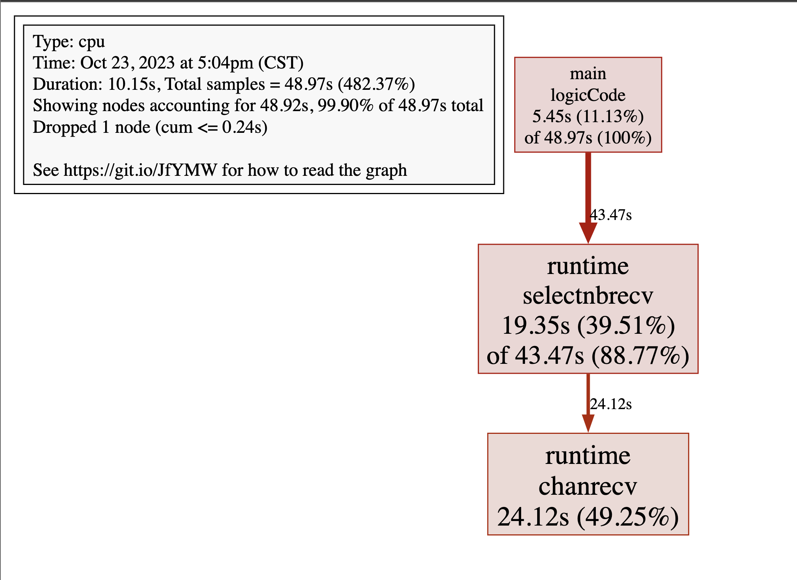

## go-torch 和火焰图

> 火焰图（Flame Graph）是 Bredan Gregg 创建的一种性能分析图表，因为它的样子近似 🔥 而得名。上面的 profiling 结果也转换成火焰图，如果对火焰图比较了解可以手动来操作。
> go-torch 是 uber 开源的一个工具，可以直接读取 golang profiling 数据，并生成一个火焰图的 svg 文件。

### 安装

```bash
go install github.com/uber/go-torch@latest
```

要生成火焰图，还需要 FlameGraph 工具：

```bash
git clone https://github.com/brendangregg/FlameGraph.git
```

然后将 FlameGraph 工具的目录添加到环境变量

```bash
vim ~/.zshrc

export PATH=$PATH:/Users/Sky_Lee/Downloads/UsefulTools/FlameGraph
```

### 使用

go-torch 默认尝试从 http://localhost:8080/debug/pprof/profile 获取 profiling 数据。它有三个常用的参数可以调整：

- -u –url：要访问的 URL，这里只是主机和端口部分
- -s –suffix：pprof profile 的路径，默认为 /debug/pprof/profile
- –seconds：要执行 profiling 的时间长度，默认为 30s

例如，对上面的 helloweb demo 进行压测的同时采集数据：

```bash
Sky_Lee@SkyLeeMacBook-Pro Test % go-torch -u http://127.0.0.1:1145 -t 30

INFO[08:42:39] Run pprof command: go tool pprof -raw -seconds 30 http://127.0.0.1:1145/debug/pprof/profile
INFO[08:43:10] Writing svg to torch.svg
```

30s 后在当前目录生成 svg 文件，使用浏览器打开即可

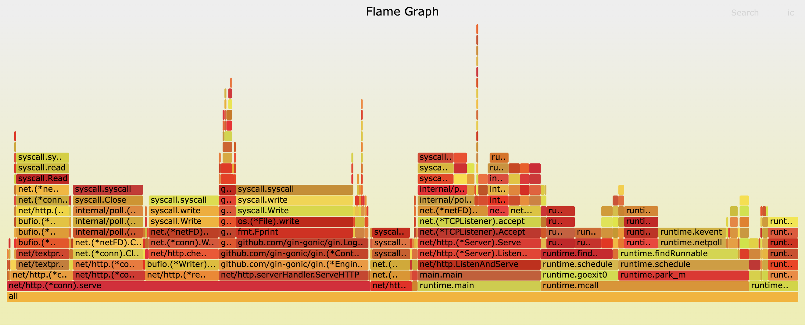

- y 轴代表 cpu 调用方法的顺序
- x 轴代表单位采样时间内，方法所占的时间的百分比，越宽，说明占用的 CPU 越多

还可以使用 go-torch 分析内存数据：

```bash
go-torch -inuse_space http://127.0.0.1:8080/debug/pprof/heap
go-torch -inuse_objects http://127.0.0.1:8080/debug/pprof/heap
go-torch -alloc_space http://127.0.0.1:8080/debug/pprof/heap
go-torch -alloc_objects http://127.0.0.1:8080/debug/pprof/heap
```

# Docker

Docker 是一种开源的 **容器化** 平台，用于轻松地创建、部署和管理应用程序。

容器化是一种虚拟化技术，它允许您 **将应用程序及其所有依赖项打包成一个独立的容器** ，以确保在不同环境中的 **可移植性** 和 **一致性** 。

**注意：Docker 不等于容器，只是容器的一种实现**

## 与虚拟机的区别

- Docker **共享宿主操作系统的内核**，而虚拟机包含一个独立的内核
- Docker 容器占用更少的内存和存储空间

> 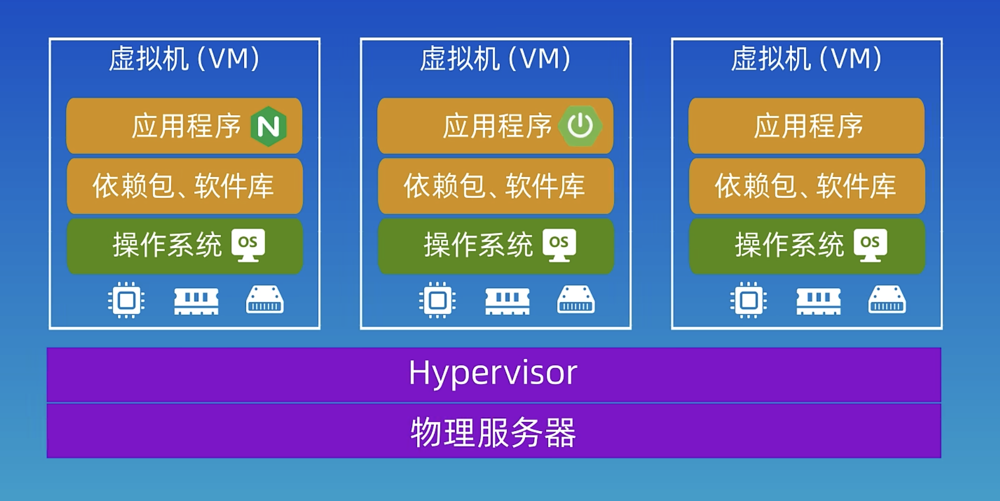
> 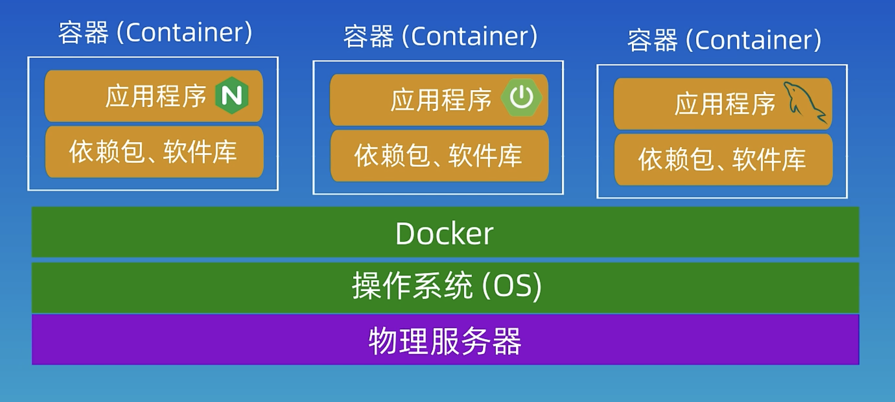

## 基本原理和概念

Docker 最基本、最重要的概念就是 **镜像**、**容器**

> Docker 镜像 **包含了一个应用程序及其所有依赖项的文件系统** 。它是一个 **只读** 的文件系统层次结构，可以用于创建 Docker 容器的运行实例。一个 Docker 镜像通常包括以下几个主要部分：
> 
> 1. **文件系统**：镜像包含了应用程序的文件系统，包括可执行文件、库、配置文件、静态资源等。这是应用程序的实际内容。
> 
> 2. **元数据**：镜像还包括关于镜像本身的元数据信息，如镜像的名称、标签、作者、描述、创建时间等。这些信息用于标识和描述镜像。
> 
> 3. **运行时配置**：Docker 镜像可以包含运行时配置，如环境变量、命令等，这些配置会在容器启动时被应用。
> 
> 4. **依赖项**：镜像可能包含应用程序所需的各种依赖项，如库文件、运行时环境、操作系统组件等。这些依赖项通常会作为文件系统的一部分存在。
> 
> 5. **分层结构**：Docker 镜像是分层的，每个层都代表了文件系统的一部分。这使得镜像可以被有效地共享和重用，因为多个镜像可以共享相同的层。当您构建新的镜像时，只需添加或修改必要的层，而不是整个文件系统。
> 
> 镜像是 Docker 容器的构建块，容器是从镜像中创建的运行实例。当运行一个容器时，它会继承镜像的文件系统、元数据和配置，并可以进行修改。容器可以读写自己的文件系统层，允许应用程序运行和存储数据。这种分层的结构和镜像的只读特性使容器可以轻松共享和分发，同时保持一致性和可移植性。

简单的理解：

镜像就是一个模板，包含了一个应用程序及其所有依赖项的文件系统，而容器是镜像的一个实例，一个镜像可以有多个实例

可以这样比喻：

镜像就像 Java 中的类，有自己的属性和方法，容器就像类的实例，一个镜像可以有多个实例

## 安装 Docker

可以在 [这个网站](https://docs.docker.com/get-docker/) 获取 docker 的桌面端

安装后，需要启动 docker，然后才能使用 docker 相关命令

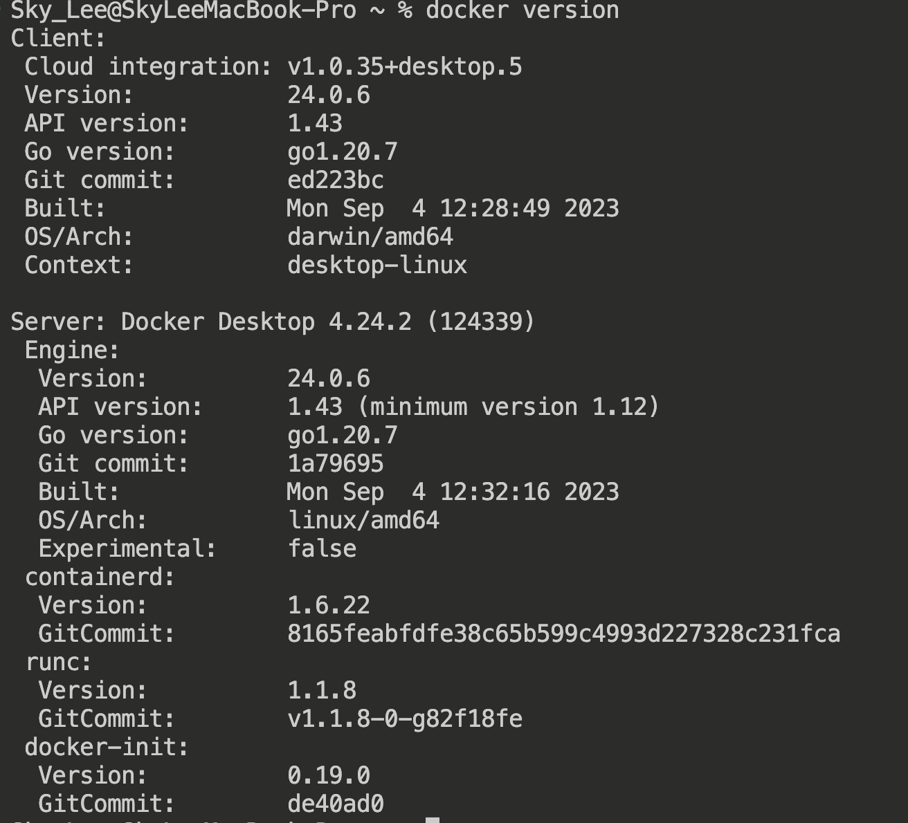

如果看不到 Server，说明没有启动 docker 服务

如果要在 Linux 服务器上安装 docker，可以查看 [官方文档](https://docs.docker.com/engine/install/centos/)

## 容器化与 Dockerfile

运行一个容器大致分为以下三步：

- 编写 Dockerfile
- 使用 Dockerfile 创建镜像
- 使用镜像创建容器
- 运行容器

> Dockerfile 是用于构建 Docker 镜像的文本文件，它包含了一系列指令和参数，描述了如何创建 Docker 镜像的过程。通过编写 Dockerfile，可以定义应用程序的 **环境和依赖项**，以便 Docker 可以根据这些指令自动构建镜像。


## 示例

下面通过一个简单的 hello-docker demo 来演示 docker 的基本使用

### 创建项目

首先，在开发环境创建一个 hello-docker 项目

然后，编写 main.go:

```go
package main

import (
	"net/http"

	"github.com/gin-gonic/gin"
)

func main()  {
	r := gin.Default()
	r.GET("/", func(ctx *gin.Context) {
		ctx.String(http.StatusOK, "hello, docker!")
	})
	r.Run(":1145")
}
```

### 制作镜像

现在，项目编写完毕，开始制作镜像

制作镜像，需要编写 Dockerfile

```bash
touch Dockerfile
```

注意：创建 Dockerfile 时，没有后缀名，并且应该遵守命名规范

内容如下：

```dockerfile
FROM golang:alpine

# 移动到工作目录：/build
WORKDIR /build

# 复制项目中的 go.mod 和 go.sum文件并下载依赖信息
COPY go.mod .
COPY go.sum .
RUN go mod download

# 将代码复制到容器中
COPY . .

# 将我们的代码编译成二进制可执行文件
RUN go build

# 声明服务监听端口
EXPOSE 1145

# 运行容器
CMD [ "./hello-docker" ]
```

然后在终端执行以下命令：

```bash
docker build -t hello-docker .
```

这将在当前目录下搜索 Dockerfile，并创建一个 docker 镜像

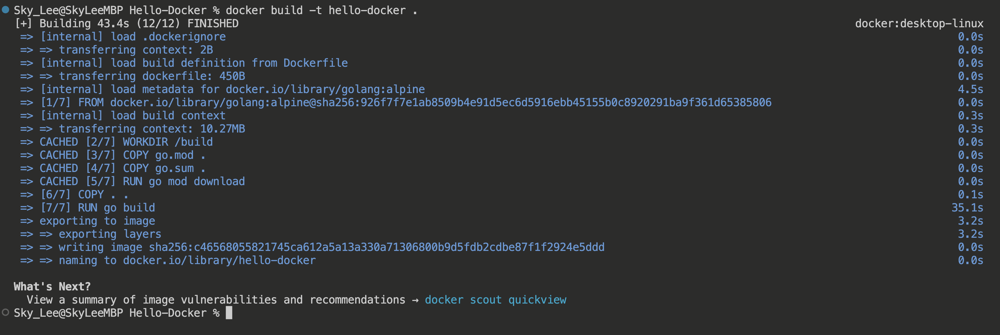

创建的镜像并不会保存在当前目录，使用：

```bash
docker images
```

查看当前存在的镜像：

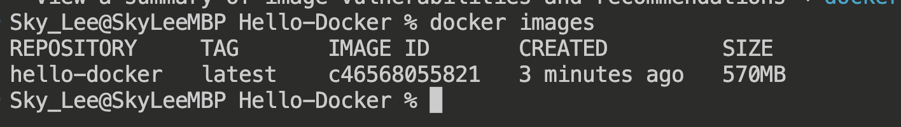

### 运行容器

基于上面创建的镜像，可以创建一个容器，并运行：

```bash
docker run -p 1145:1145 hello-docker
```

这里 -p 选项将容器的 1145 端口绑定到了本机的 1145 端口

现在，就可以在浏览器访问 `localhost:1145` 了

### 上传 Docker 镜像到服务器

本地测试没问题，就可以将 Docker 镜像打包成 tar 文件，上传到服务器

```bash
docker save -o hello-docker.tar hello-docker:latest
```

该命令会将 hello-docker 镜像打包成一个 tar 包

上传到服务器后，在服务器下运行：

```bash
docker load -i hello-docker.tar
```

该命令会导入 hello-docker 镜像

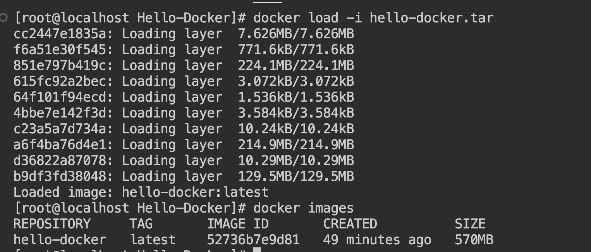

**注意：** 需要超级用户权限执行该命令

### 在服务器上启动 hello-docker 项目

```bash
docker run -p 1145:1145 hello-docker
```

现在，我们的 hello-docker 项目就成功部署在服务器上了

### 删除 hello-docker 项目

查看当前所有的 docker 容器：

```bash
docker container ls -a 
```

删除 hello-docker 容器：

```bash
docker rm <container name>
```

删除 hello-docker 镜像：

```bash
docker image rm <image name>
```

## 分阶段构建

> 我们的Go程序编译之后会得到一个可执行的二进制文件，其实在最终的镜像中是不需要go编译器的，也就是说我们只需要一个运行最终二进制文件的容器即可。
>
> Docker的最佳实践之一是通过仅保留二进制文件来减小镜像大小，为此，我们将使用一种称为多阶段构建的技术，这意味着我们将通过多个步骤构建镜像。

```dockerfile
FROM golang:alpine AS builder

# 移动到工作目录：/build
WORKDIR /build

# 复制项目中的 go.mod 和 go.sum文件并下载依赖信息
COPY go.mod .
COPY go.sum .
RUN go mod download

# 将代码复制到容器中
COPY . .

# 将我们的代码编译成二进制可执行文件
RUN go build

# 声明服务端口
EXPOSE 1145


# 创建一个小的镜像 #
FROM scratch

COPY --from=builder /build/hello-docker /

ENTRYPOINT [ "/hello-docker" ]
```

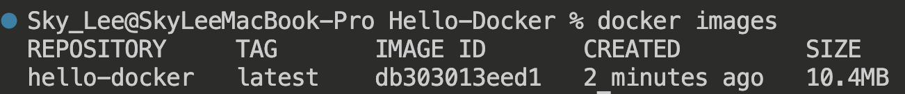

生成的镜像大小仅 10.4 MB，非常小

> scratch 是一个特殊的空白镜像，它是最小的基础镜像，没有任何操作系统或文件系统。通常用于构建静态二进制文件的 Docker 镜像。

## Docker Compose

Docker Compose 是一个用于定义和运行多个 Docker 容器的工具，以便协同运行复杂的多容器应用程序。

例如，一个 Web 程序采取前后端分离的架构，前端、后端、数据库、缓存、负载均衡 都有一个容器，这些容器之间具有依赖关系，使用 Docker Compose 就可以快速启动 Web 项目

Docker Compose 使用 docker-compose.yml 配置文件描述整个应用程序的架构

以下是一个示例的 `docker-compose.yml` 文件，用于启动一个前后端分离的 Web 项目，后端连接 MySQL 和 Redis。该示例使用了四个服务：前端、后端、MySQL 和 Redis。

```yaml
version: '3'
services:
  frontend:
    image: your-frontend-image:tag
    ports:
      - "80:80"
    depends_on:
      - backend
    networks:
      - webnet

  backend:
    image: your-backend-image:tag
    environment:
      MYSQL_HOST: mysql
      REDIS_HOST: redis
    networks:
      - webnet
    links:
      - mysql
      - redis

  mysql:
    image: mysql:latest
    environment:
      MYSQL_ROOT_PASSWORD: your-root-password
      MYSQL_DATABASE: your-database-name
    networks:
      - webnet

  redis:
    image: redis:latest
    networks:
      - webnet

networks:
  webnet:
```

- `frontend` 服务代表前端应用程序。您需要将 `your-frontend-image:tag` 替换为您的前端应用程序的 Docker 镜像。
- `backend` 服务代表后端应用程序。您需要将 `your-backend-image:tag` 替换为您的后端应用程序的 Docker 镜像。在 `environment` 部分设置了 MySQL 和 Redis 的连接信息。
- `mysql` 服务使用了 MySQL 官方镜像，并配置了根密码和数据库名称。您可以根据需要修改这些环境变量。
- `redis` 服务使用了官方 Redis 镜像。
- `ports` 指定了前端服务在主机上的端口映射，这里映射到主机的端口 80。
- `depends_on` 指定了 `frontend` 服务依赖于 `backend` 服务，确保后端应用程序启动后前端应用程序才能启动。
- `links` 用于将 `mysql` 和 `redis` 服务链接到 `backend` 服务，以便后端应用程序能够访问这两个服务。
- `networks` 部分定义了一个名为 `webnet` 的自定义网络，用于连接所有服务。

## 常用 docker 命令

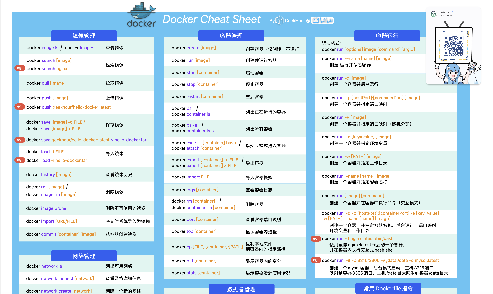

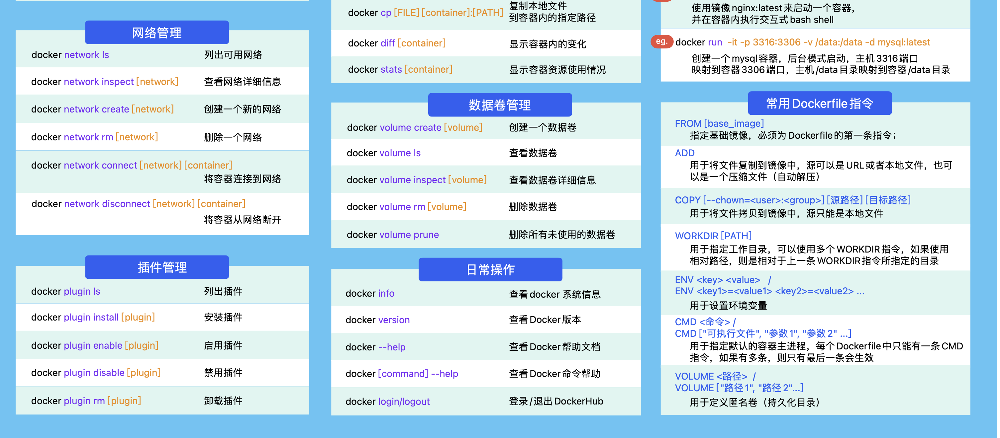

# 搜索

想提供一个接口：

```go
v1.GET("/post/search", controller.PostSearchHandler)
```

该接口根据用户传进的关键词，在帖子的：

- 标题
- 正文

中去搜索

但是遇到了难题：

1. 标题模糊查询如何实现？
2. 怎么建立索引？
3. 全文模糊查询如何实现？
4. 怎么使用缓存加快查询速度？

对于 tilte，如果直接在 MySQL 中模糊查询：

```go
func DemoSelectPostIDsByTitleKeyword(pageNum, pageSize int64, keyword string) ([]string, error) {
	sqlStr := "SELECT post_id FROM posts WHERE title LIKE ? LIMIT ?, ?"
	key := "%" + keyword + "%" // title 索引失效
	start := (pageNum - 1) * pageSize

	postIDs := make([]string, 0)
	res := db.Raw(sqlStr, key, start, pageSize).Scan(&postIDs)
	if res.Error != nil {
		return nil, errors.Wrap(res.Error, "get post_ids by keyword")
	}

	return postIDs, nil
}
```

对于 title 建立的索引会失效，原因：

- 头部模糊查询
- 就算不用头部模糊查询，例如 `where title like 'tit%'`，如果表中存在大量以 `tit` 开头的标题，索引也不会生效（不走索引更快）

于是查看之前的笔记，发现似乎 MySQL 的 **全文索引** 可以解决这个问题

对 title 和 content 字段建立全文索引：

```sql
create fulltext index idx_title on posts(title);
create fulltext index idx_content on posts(content(512)); -- 前缀索引
```

查询的 SQL 语句：

```sql
explain
select post_id, title from posts where MATCH(title) AGAINST('simple');

explain
select post_id from posts where MATCH(content) AGAINST('docker');
```

但是这种方式对中文支持不太好，例如有两篇帖子，标题和内容如下：

```
+----+------------------+--------------+------------------+--------+--------------------------+---------------------+---------------------+---------------------+
| id | post_id          | community_id | author_id        | status | title                    | content             | created_at          | updated_at          |
+----+------------------+--------------+------------------+--------+--------------------------+---------------------+---------------------+---------------------+
| 84 | 6594082939867136 |            2 | 4488717146263552 |      1 | 测试对中文的支持            | 就像标题一样          | 2023-11-01 15:04:51 | 2023-11-01 15:05:02 |
| 85 | 6595071927390208 |            2 | 4488717146263552 |      1 | Test support for English | just like the title | 2023-11-01 15:08:47 | 2023-11-01 15:08:57 |
+----+------------------+--------------+------------------+--------+--------------------------+---------------------+---------------------+---------------------+
```

```sql
select post_id from posts where MATCH(title) AGAINST('中文'); -- failed

select post_id from posts where MATCH(content) AGAINST('标题'); -- failed

select post_id from posts where MATCH(title) AGAINST('english'); -- success

select post_id from posts where MATCH(content) AGAINST('title'); -- success
```